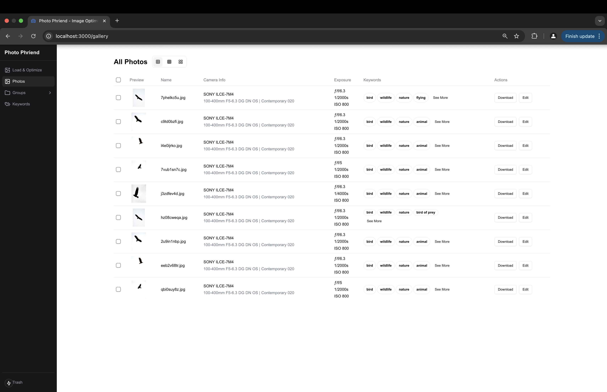
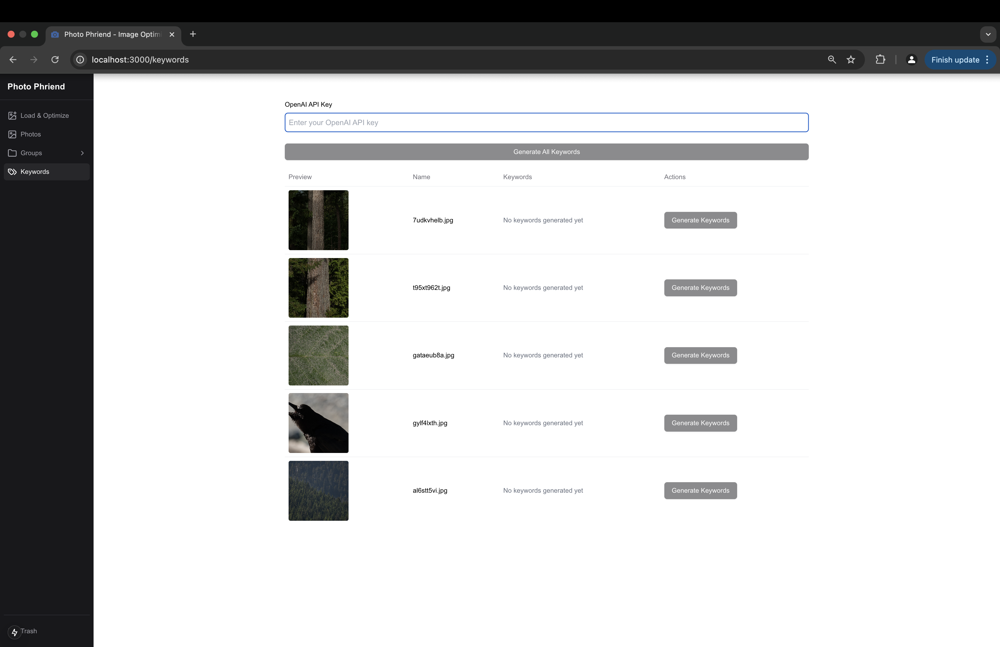
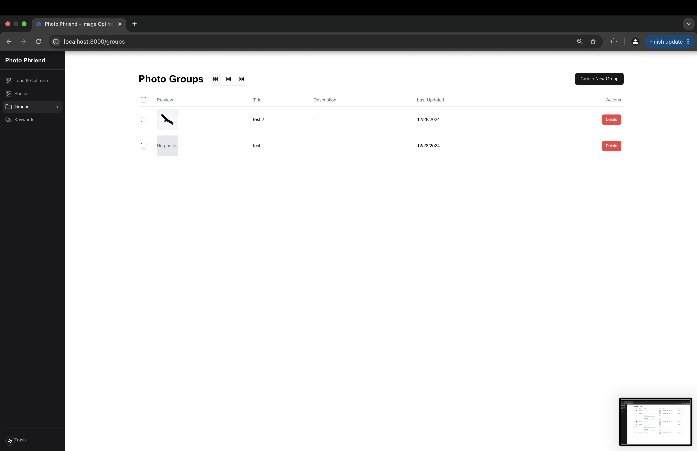

# Photo Phriend


A powerful local photo management application that helps you organize, optimize, and enhance your photo collection with AI-powered features. Designed to run locally but db can be hooked up easily to allow for cloud sync. No tracking, no ads, no data sharing, just a central place to manage your photos that you want to keep seperate from your existing cloud photo libraries.

## Features

### 📸 Intelligent Photo Management
- Local photo organization with SQLite database
- Comprehensive EXIF data tracking and management
- User-friendly gallery interface
- Bulk download functionality with ZIP file export

### 🔄 Automatic Photo Optimization
Creates four versions of each photo:
- **Original**: Preserves the untouched source file
- **Optimized**: Maintains EXIF data with 80% quality reduction
- **Minified**: 4x size reduction with optimization
- **Thumbnail**: 8x size reduction with optimization

### 🤖 AI-Powered Keywords
- Automatic keyword generation using OpenAI's vision models
- Supports both single image and batch processing
- Smart keyword organization and management

### 📝 Metadata Management
- View and edit EXIF data
- Manage photo descriptions and keywords using OpenAI or manually
- Track photo versions and modifications

### 📂 Grouping and Organization
- Create and manage groups of photos
- View and edit group details
- Organize photos into groups

## Saves all data to a local sqlite db in the folder. To initialize the database, run
``` bash
localhost:3000/api/db/create-sql-tables
```

## Screenshots

### Photos Page


### Keywords Page


### Groups Page



## Getting Started

### Prerequisites
- Node.js
- SQLite
- OpenAI API key

### Installation
1. Clone the repository:
```bash
git clone https://github.com/yourusername/photo-phriend.git
```

2. Install dependencies:
```bash
npm install
```

3. Start the development server:
```bash
npm run dev
```

4. Initialize the database:
visit the following url in your browser to initialize the database. Creates a photo-phriend.db file in the db folder.
```bash
localhost:3000/api/db/create-sql-tables
```

5. Open [http://localhost:3000](http://localhost:3000) in your browser. This will take you to the Load & Optimize page.

6. Start by adding photos in the Load & Optimize page. 


### To Generate Keywords
This will take all of the images you have selected, organize them in different arrays based on their aspect ratio, then combine 1-4 images into a quadrant composite image with a maximum 500px on the longest side. Send that image to OpenAI and then map the keywords based on the quadrant image. Doing mutliple images at once saves in api calls vs doing one at a time.
```bash
1. Go to the Gallery page.
2. Select the photos you want to generate keywords for.
3. Click the "Generate Keywords" button.
4. Click Generate All Keywords button on the keywords page.
5. The keywords will be generated and added to the database. They can be edited later on by clicking the edit button on the All Photos page.
```
OR For a single image:
This sends a single image to the openAI api to generate keywords.
```bash
1. click generate keywords on the image you want to generate keywords for.
2. The keywords will be generated and added to the database. They can be edited later on by clicking the edit button on the All Photos page.
```


## Tech Stack
- Next.js
- SQLite
- OpenAI API
- TailwindCSS
- TypeScript

## Database Structure
The application uses SQLite to manage:
- Photo metadata and file information
- EXIF data in both raw and structured formats
- Photo versions and optimizations
- AI-generated keywords and relationships
- Trash can for deleted photos


## Contributing
Contributions are welcome! Please feel free to submit a Pull Request.


